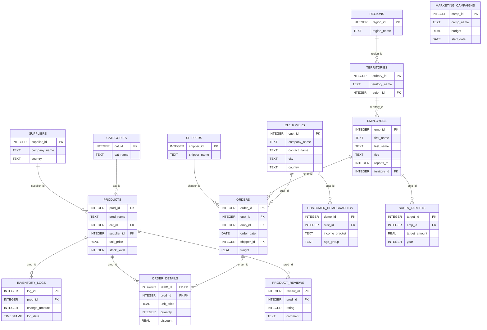

# ER Diagram (Mermaid) — `sales.db`

This diagram shows how the tables in `sales.db` connect to each other (primary keys and foreign keys).

```mermaid
erDiagram
  REGIONS {
    INTEGER region_id PK
    TEXT region_name
  }

  TERRITORIES {
    INTEGER territory_id PK
    TEXT territory_name
    INTEGER region_id FK
  }

  EMPLOYEES {
    INTEGER emp_id PK
    TEXT first_name
    TEXT last_name
    TEXT title
    INTEGER reports_to
    INTEGER territory_id FK
  }

  CATEGORIES {
    INTEGER cat_id PK
    TEXT cat_name
  }

  SUPPLIERS {
    INTEGER supplier_id PK
    TEXT company_name
    TEXT country
  }

  PRODUCTS {
    INTEGER prod_id PK
    TEXT prod_name
    INTEGER cat_id FK
    INTEGER supplier_id FK
    REAL unit_price
    INTEGER stock_level
  }

  CUSTOMERS {
    INTEGER cust_id PK
    TEXT company_name
    TEXT contact_name
    TEXT city
    TEXT country
  }

  SHIPPERS {
    INTEGER shipper_id PK
    TEXT shipper_name
  }

  ORDERS {
    INTEGER order_id PK
    INTEGER cust_id FK
    INTEGER emp_id FK
    DATE order_date
    INTEGER shipper_id FK
    REAL freight
  }

  ORDER_DETAILS {
    INTEGER order_id PK, FK
    INTEGER prod_id PK, FK
    REAL unit_price
    INTEGER quantity
    REAL discount
  }

  INVENTORY_LOGS {
    INTEGER log_id PK
    INTEGER prod_id FK
    INTEGER change_amount
    TIMESTAMP log_date
  }

  CUSTOMER_DEMOGRAPHICS {
    INTEGER demo_id PK
    INTEGER cust_id FK
    TEXT income_bracket
    TEXT age_group
  }

  PRODUCT_REVIEWS {
    INTEGER review_id PK
    INTEGER prod_id FK
    INTEGER rating
    TEXT comment
  }

  MARKETING_CAMPAIGNS {
    INTEGER camp_id PK
    TEXT camp_name
    REAL budget
    DATE start_date
  }

  SALES_TARGETS {
    INTEGER target_id PK
    INTEGER emp_id FK
    REAL target_amount
    INTEGER year
  }

  %% Relationships (FK → PK)
  REGIONS ||--o{ TERRITORIES : "region_id"
  TERRITORIES ||--o{ EMPLOYEES : "territory_id"

  CATEGORIES ||--o{ PRODUCTS : "cat_id"
  SUPPLIERS ||--o{ PRODUCTS : "supplier_id"

  CUSTOMERS ||--o{ ORDERS : "cust_id"
  EMPLOYEES ||--o{ ORDERS : "emp_id"
  SHIPPERS ||--o{ ORDERS : "shipper_id"

  ORDERS ||--o{ ORDER_DETAILS : "order_id"
  PRODUCTS ||--o{ ORDER_DETAILS : "prod_id"

  PRODUCTS ||--o{ INVENTORY_LOGS : "prod_id"
  CUSTOMERS ||--o{ CUSTOMER_DEMOGRAPHICS : "cust_id"
  PRODUCTS ||--o{ PRODUCT_REVIEWS : "prod_id"

  EMPLOYEES ||--o{ SALES_TARGETS : "emp_id"
```
